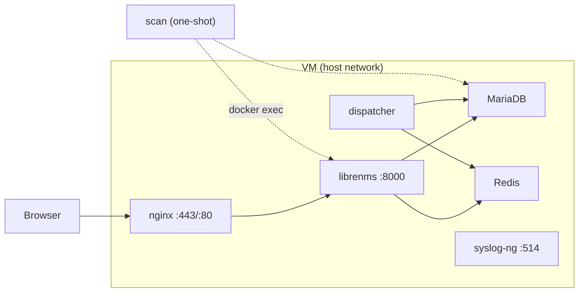

# monitor_stack

**librenms/** — LibreNMS on a dedicated VM: SNMP monitoring, syslog receiver, auto-discovery, graphs.

LibreNMS replaces NMIS9. It polls SNMP (CPU, memory, disk, swap, I/O, interfaces), receives syslog, auto-discovers your estate by subnet sweep, and ships with decent pre-built graphs for all of it.

---

## Prerequisites

- Ports to open inbound on your Proxmox firewall:
  - `443/tcp` — LibreNMS web UI (HTTPS via nginx)
  - `514/tcp` — syslog ingest (from all managed nodes)
  - `161/udp` — SNMP polling outbound to devices (usually open by default)
  - Port `8000` is internal only — do not expose it

## LXC Container Setup (Recommended)

Run this on the Proxmox host to create and start the container:

```bash
pveam download local debian-12-standard_12.12-1_amd64.tar.zst
pct create 115 local:vztmpl/debian-12-standard_12.12-1_amd64.tar.zst --hostname monitor --cores 2 --memory 4096 --rootfs local-lvm:10 --net0 name=eth0,bridge=vmbr0,ip=dhcp --unprivileged 0 --features nesting=1,keyctl=1 --start 1
```

> **Note:** If Docker warns about "system 252 detected, you may need to enable nesting", run:
>
> ```bash
> pct stop 115
> pct set 115 --features nesting=1,keyctl=1
> pct start 115
> ```

Install **Docker Engine** from Docker’s install script (includes the **Compose V2** plugin as `docker compose`). Do **not** use Debian’s `docker.io` / `docker-compose` packages for this stack.

```bash
pct enter 115
apt update && apt install -y ca-certificates curl
curl -fsSL https://get.docker.com | sh
docker compose version   # should print compose plugin, not “docker-compose: command not found”
```

See [Docker Engine install](https://docs.docker.com/engine/install/) if you need distro-specific steps instead of the convenience script.

---

## LibreNMS Stack

Everything lives under `librenms/`. Compose file: `librenms/docker-compose.yaml`. Lifecycle scripts use **`docker compose`** (V2 plugin). Config template: `librenms/.env.example` → copy to **`librenms/.env`** (gitignored).

### Architecture

All services use **host networking**: they talk on `127.0.0.1` like normal processes on the VM. Data is stored on the host at `**DATA_DIR`** (bind mounts to `DATA_DIR/db` and `DATA_DIR/librenms`), not as anonymous Docker volumes.




**Roles in one sentence each**


| Service      | Container             | Always on?     | Does                                                                       |
| ------------ | --------------------- | -------------- | -------------------------------------------------------------------------- |
| `db`         | `librenms-db`         | Yes            | MariaDB; files under `DATA_DIR/db`.                                        |
| `redis`      | `librenms-redis`      | Yes            | Cache + sessions for LibreNMS.                                             |
| `librenms`   | `librenms`            | Yes            | Web app and CLI; listens **127.0.0.1:8000**.                               |
| `dispatcher` | `librenms-dispatcher` | Yes            | Poll/discovery queue worker.                                               |
| `syslogng`   | `librenms-syslogng`   | Yes            | Syslog TCP **514** on the host.                                            |
| `nginx`      | `librenms-nginx`      | Yes            | TLS on **443**, HTTP→HTTPS on **80**, proxy to :8000.                      |
| `scan`       | `librenms-scan`       | **No — exits** | Bootstrap: admin user, optional imports, `lnms scan`. Needs Docker socket. |


Only `**scan`** is one-shot. To run bootstrap again after it exited: `docker compose up -d` from `librenms/` (starts a new `scan` task).

### Environment variables (quick answers)


| Question                               | Answer                                                                                                                                                                                          |
| -------------------------------------- | ----------------------------------------------------------------------------------------------------------------------------------------------------------------------------------------------- |
| Where are they defined?                | `**librenms/.env**`                                                                                                                                                                             |
| Who reads `.env`?                      | **Docker Compose**, from the directory that contains `docker-compose.yaml` (run compose from `**librenms/`**).                                                                                  |
| How do they get into containers?       | Compose replaces `**${NAME}**` in `docker-compose.yaml`. Each service only gets variables listed under its `**environment:**` block.                                                            |
| Does every service see every variable? | **No.** Example: `DISCOVERY_SUBNET` / `SNMP_COMMUNITY` are only on `**librenms`**. `**scan**` gets admin/DB/API flags; it runs `lnms` **inside** `librenms`, so scans use `**librenms`**’s env. |
| What about `config.php`?               | Mounted into `**librenms**`. It calls `**getenv()**` for URL, SNMP, subnets, syslog purge — those must be passed into the `**librenms**` container via compose.                                 |


If a value looks missing: set it in `.env`, confirm it appears under that service in `docker-compose.yaml`, then `docker compose up -d` (recreate containers).

### Configure `.env`

```bash
cp librenms/.env.example librenms/.env
```

Edit at least: `DATA_DIR`, `TZ`, `DNS_SERVER`, `APP_URL`, DB fields, `SNMP_COMMUNITY`, `DISCOVERY_SUBNET`, `LNMS_ADMIN_USER`, `LNMS_ADMIN_PASS`. Optional: `LNMS_API_TOKEN` (from `openssl rand -hex 16`) plus `IMPORT_ALERT_COLLECTION` / `IMPORT_SERVICES` — see `.env.example` comments.

### Lifecycle scripts

In `librenms/scripts/utility/` (run from anywhere; scripts `cd` to `librenms/`):


| Script                    | Effect                               |
| ------------------------- | ------------------------------------ |
| `build-stack.sh`          | Build, `up -d`                       |
| `restart-stack.sh`        | `down`, `up -d` (data kept)          |
| `upgrade-stack.sh`        | Pull/rebuild/restart (data kept)     |
| `destructive-recreate.sh` | **Deletes `DATA_DIR` data**, rebuild |
| `destroy-stack.sh`        | **Deletes data**, stop, no rebuild   |


### Start and logs

```bash
cd ~/projects/LibreNMS/librenms
./scripts/utility/build-stack.sh
docker logs -f librenms
docker logs librenms-scan
```

First boot can take a few minutes (DB init, migrations).

### Command cheat sheet

Run `**lnms**` as user `**librenms**` inside the app container. Replace IPs and communities with yours.

**Discovery and devices**

```bash
docker exec -u librenms librenms lnms scan
docker exec -u librenms librenms lnms scan -v
docker exec -u librenms librenms lnms network:scan --network 10.0.0.0/24
docker exec -u librenms librenms lnms device:discover HOSTNAME
docker exec -u librenms librenms lnms device:add -2 -c COMMUNITY IP
docker exec -u librenms librenms lnms device:add --ping-fallback IP
docker exec -u librenms librenms lnms device:add --ping-fallback --force-add IP
docker exec -u librenms librenms lnms list
```

**Config (UI/DB can override file-based values)**

```bash
docker exec -u librenms librenms lnms config:get nets
docker exec -u librenms librenms lnms config:get snmp.community
```

**Users**

```bash
docker exec -u librenms librenms lnms user:add --password='PASSWORD' --role=admin USERNAME
```

**Stack / debugging**

```bash
cd ~/projects/LibreNMS/librenms
docker compose ps
docker logs -f librenms-nginx
docker logs librenms-syslogng
docker compose up -d --force-recreate scan
docker exec librenms env | grep -E 'SNMP|DISCOVERY'
docker exec -u librenms librenms env | grep -E 'SNMP|DISCOVERY'
```

**Connectivity from inside `librenms` (host network = same as VM)**

```bash
docker exec librenms ping -c 3 IP
docker exec librenms nc -vzw2 IP 22
docker exec librenms nc -vzuw2 IP 161
docker exec librenms snmpget -v2c -c COMMUNITY IP sysName.0
```

**Database (password from `.env`, never commit it)**

```bash
docker exec -e MYSQL_PWD='YOUR_DB_PASSWORD' librenms-db mariadb -u librenms librenms -e "SHOW TABLES LIKE '%alert%';"
```

### When something breaks

- **Bootstrap / first login / auto-scan:** read `**docker logs librenms-scan`**, not only `librenms`.
- `**SQLSTATE ... Connection refused` to MySQL during bootstrap:** MariaDB was not accepting connections yet, or `librenms` could not reach `127.0.0.1:3306`. Check `**docker logs librenms-db`**, wait, then recreate bootstrap: `docker compose up -d --force-recreate scan` from `librenms/`.
- `**lnms config:get nets` works but DB commands fail:** `config:get` can reflect file config before the app has a stable DB session; treat **user:add / scan** errors as “DB or migrations not ready yet” and retry after DB is up.
- **Web UI asks to create a user:** bootstrap did not finish; use `**lnms user:add`** above or fix `librenms-scan` errors and re-run `scan`.
- **Subnets or SNMP wrong:** check `**lnms config:get nets`** and LibreNMS **Settings** (DB overrides `config.php`).

### Ping-only devices (no SNMP)

```bash
docker exec -u librenms librenms lnms device:add --ping-fallback 10.0.1.10
```

### Web UI and validate

Use `**APP_URL**` as the URL you type in the browser. **nginx** serves **443** (self-signed cert generated at container start) and redirects **80** to HTTPS; LibreNMS itself stays on **127.0.0.1:8000**. After changing `.env` or compose, recreate `**librenms`** so its generated env stays consistent.

Admin > **Validate Install**. This stack uses `**CACHE_DRIVER=redis`** and `**SESSION_DRIVER=redis**` (see [official LibreNMS Docker image](https://github.com/librenms/docker)).

### Alert rule import (optional)

If `LNMS_API_TOKEN` is set and `IMPORT_ALERT_COLLECTION=1`, bootstrap imports the bundled collection (same idea as **Alerts > Add rule from collection**). Manual re-run:

```bash
cd ~/projects/LibreNMS/librenms
export LNMS_API_TOKEN='same as .env'
./scripts/utility/utility_librenms_import_alerts.sh
```

### Dashboards

No default dashboard. Create one under **Dashboard > New Dashboard** (e.g. Availability Map, Device Summary, Alerts, Syslog, Top Interfaces). Default for everyone: **Settings > WebUI Settings > Dashboard Settings**.

### Data on disk

All persistent state is under `**DATA_DIR`** (default `/opt/monitor_stack`):

```
DATA_DIR/db/       — MariaDB
DATA_DIR/librenms/ — RRD, LibreNMS data
```

Survives `docker compose down`. Removed only if you run `**destructive-recreate.sh**` / `**destroy-stack.sh**` or delete `DATA_DIR` yourself. Back up with rsync or your usual backup tool.

---

## SNMP on Debian hosts

LibreNMS polls via SNMP. Each Debian VM needs `snmpd` installed and configured:

```bash
apt install snmpd
```

Minimal `/etc/snmp/snmpd.conf`:

```
rocommunity public
# Expose CPU, memory, disk, swap, I/O via UCD-SNMP-MIB
disk /
disk /var
```

Restart: `systemctl restart snmpd`

LibreNMS will discover and start graphing CPU, memory, swap, disk, load, I/O, and interfaces automatically once the device is found.

### Monitoring specific processes

Add `proc` lines to `/etc/snmp/snmpd.conf` to expose process counts via SNMP:

```
# Alert if the process count drops below 1
proc nginx 1
```

LibreNMS picks these up automatically under **Device > Processes** and can alert if the count goes to zero.

### Monitoring specific TCP ports (services)

Use LibreNMS's **Services** feature for Nagios-style TCP port checks — useful for checking that a web app or other service is actually accepting connections:

1. **Device > Services > Add Service**
2. Type: `tcp`
3. Parameters: `-H 127.0.0.1 -p 443`
4. Set alert thresholds

This alerts if the port stops accepting connections, independently of SNMP.
